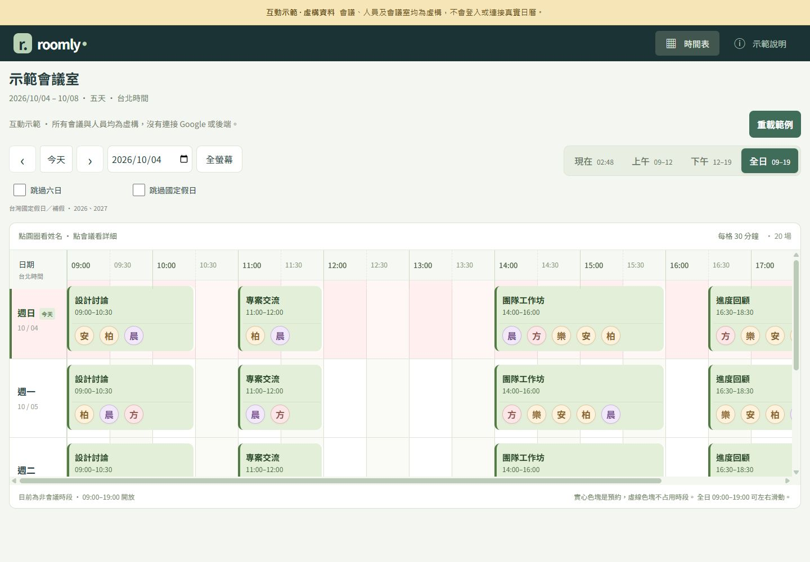

# Roomly 會議室看板

給單一會議室使用的多人日曆看板，適合放在平板、手機或桌面瀏覽器。使用者用 Google 登入，通過管理員核准後同意自己的日曆權限，大家就能查看同一個會議室的預約。

**[開啟線上展示](https://terry-eric.github.io/roomly/)**：全部是虛構會議與人物，可以直接操作，不需帳號。GitHub Pages 展示版不會登入 Google、讀取真實日曆、寄信或提供共用後端。



**[附截圖的操作教學](docs/SCREENSHOTS.md)** · **[自己發布 GitHub Pages](docs/DEPLOYMENT.md#github-pages發布展示版)** · **[部署真實日曆版本](docs/DEPLOYMENT.md#1-準備環境)**

## 可以做什麼

- 台北時區 09:00–19:00，每格 30 分鐘的多日甘特圖。
- 日期切換、今天高亮、目前時段置中、跳過週末或台灣國定假日（內建 2026、2027 年資料）。
- 點人物圓圈查看姓名，點預約查看受邀者與 Google Meet 連結。
- 全螢幕預覽、手機與平板排版；正式版支援安裝為 PWA。
- 正式版匯入每位核准成員的主要日曆及可讀取的共用日曆，以管理員設定的地點篩選。
- 白名單管理、各帳號授權狀態、手動同步、Google 變更通知及背景補查。

Roomly 顯示 Google 日曆中的預約；建立或修改預約仍在 Google 日曆操作。受邀者名單不代表實際出席人員。

## 先選擇使用方式

| 方式 | 適合用途 | Google / Cloudflare 設定 | 真實共用資料 |
| --- | --- | --- | --- |
| 線上展示或 `npm run demo` | 看介面、試觸控操作、分享作品 | 不需要 | 無，只有虛構範例 |
| `npm run dev` | 本機開發登入、白名單和日曆功能 | 自己的 Google OAuth；本機 D1 | 只存在本機資料庫 |
| Cloudflare Workers + D1 | 團隊正式使用，關閉網頁也能同步 | 自己的 Google OAuth、Cloudflare 與部署網址 | 核准成員共用同一看板 |

GitHub Pages 只能放展示版。要使用真實 Google 日曆，請部署完整 Worker 後端。

## 本機快速看展示

需要 Node.js 24 或更新版本與 npm。以下指令在專案資料夾執行：

```sh
git clone https://github.com/terry-eric/roomly.git
cd roomly
npm ci
npm run demo
```

開啟 [http://127.0.0.1:4173](http://127.0.0.1:4173)。範例資料由本機產生，重新載入不會同步任何真實帳號。結束時在終端機按 `Ctrl+C`。

只要產生可放到靜態網站的展示檔案：

```sh
npm run build:demo
```

輸出在 `demo-dist/`。GitHub Pages 工作流程發布這個資料夾，正式版的 `dist/` 不適合直接當作無後端展示使用。

同一個 Wi-Fi 的手機或平板要查看本機範例，可明確開啟區域網路預覽：

```sh
npm run demo -- --host 0.0.0.0
```

在手機輸入 `http://<電腦的區域網路IP>:4173/`，並允許作業系統的區域網路連線。這個指令只分享虛構展示資料。

## 本機與雲端完整版

請依序閱讀 **[安裝與部署](docs/DEPLOYMENT.md)**，完成 Google OAuth、自己的管理員帳號及密鑰設定，再執行：

```sh
npm run dev
```

本機入口是 [http://localhost:3000/roomly/](http://localhost:3000/roomly/)。這個指令會建立正式版靜態檔、套用本機資料庫 migrations，再啟動 Worker；它不會部署到雲端。

一般成員不需要設定 Client ID 或密鑰。核准成員登入後，缺少必要日曆權限時，網站會接著請本人同意兩項唯讀權限。加入白名單不能代替 Google 授權，也不能讓管理員直接讀取尚未授權的帳號。

**[共用日曆與同步方式](docs/SHARED-CALENDAR.md)** 說明來源、地點篩選、撤銷授權及同步時間。

## 開發指令

| 指令 | 用途 |
| --- | --- |
| `npm ci` | 依鎖定版本安裝相依套件 |
| `npm run demo` | 開啟純範例展示伺服器 |
| `npm run build:demo` | 產生 `demo-dist/` 展示版 |
| `npm run dev` | 建置、初始化本機 D1 並啟動完整 Worker |
| `npm run db:local` | 套用本機 migrations |
| `npm run db:remote` | 套用設定中的雲端 D1 migrations |
| `npm test` | 執行前後端測試 |
| `npm run typecheck` | 檢查 TypeScript |
| `npm run build` | 產生 Worker 使用的 `dist/roomly/` |
| `npm run check:deploy` | 建置並執行部署 dry run |
| `npm run deploy` | 建置並部署到自己的 Cloudflare 帳號 |

前端是 HTML、CSS 與 JavaScript；後端是 TypeScript Cloudflare Worker，使用 D1 儲存登入、白名單、加密日曆授權和符合地點的會議快取。`migrations/` 會逐版建立資料表。

`.dev.vars.example` 只提供設定欄位。本機 `.dev.vars`、OAuth Client Secret、加密金鑰、資料庫匯出與真實會議資料都不應加入 Git。本公開版本不附帶任何可使用的私人帳號或密鑰。

Google 的 Testing、正式發布與敏感權限驗證是不同設定；發布這份程式碼不會讓自己的 Google 專案自動通過驗證。部署文件附有各項官方說明。
