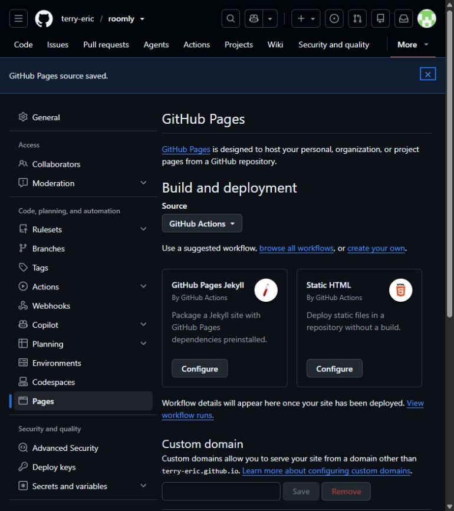

# 安裝與部署

這份文件用來建立**自己的 Roomly**。範例中的 `roomly.example.com`、Email、Client ID 與資料庫 ID 都必須換成自己的設定。GitHub Pages 展示版不需要以下步驟。

## GitHub Pages：發布展示版

若只想分享可操作的畫面，使用 GitHub Pages 即可，不需要 Google OAuth、Cloudflare 或 secrets。

1. 在 GitHub 開啟 [Roomly repository](https://github.com/terry-eric/roomly)，按 **Fork** 建立自己的公開 repository。
2. 在自己的 repository 開啟 **Settings → Pages**，將 **Build and deployment → Source** 設為 **GitHub Actions**。
3. 專案已附 `.github/workflows/pages.yml`，不必再選頁面下方的 Jekyll 或 Static HTML 範本。到 **Actions**，在 fork 中啟用工作流程後，選 **Deploy demo to GitHub Pages → Run workflow**，使用 `main` 分支執行。
4. 等 `build` 和 `deploy` 完成，開啟該 workflow 的部署連結，或回 **Settings → Pages** 找到網站網址。一般為 `https://<自己的GitHub帳號>.github.io/roomly/`。



圖中的 `terry-eric/roomly` 是本專案範例；操作時使用自己的 repository。之後推送到 `main` 會重新發布。Workflow 執行 `npm ci` 和 `npm run build:demo`，只上傳 `demo-dist/`，所有 assets 使用相對路徑，支援 repository 子路徑。

GitHub Pages 上是公開的虛構資料展示，Google 登入、白名單、日曆同步和 Email 都沒有啟用。要供團隊使用真實資料，接著完成下方的完整後端部署。[GitHub 官方 Pages 設定](https://docs.github.com/en/pages/getting-started-with-github-pages/configuring-a-publishing-source-for-your-github-pages-site)

## 1. 準備環境

安裝 Node.js 24 或更新版本，在專案根目錄執行：

```sh
npm ci
```

完整版需要一個 Google Cloud 專案及 Web application OAuth client。雲端部署另需要 Cloudflare 帳號與 D1。管理員可使用 Gmail 或由 Google 驗證的 Workspace 帳號；`ADMIN_EMAIL` 必須與登入帳號完全相符。本專案不將非 Gmail、也沒有 Workspace 網域身分的外部 Email 自動提升為管理員。

## 2. 設定 Google OAuth

1. 在 [Google Cloud Console](https://console.cloud.google.com/) 建立自己的專案，啟用 **Google Calendar API**。
2. 在 **Google Auth Platform → Branding** 填寫應用程式名稱、支援聯絡信箱與開發者聯絡信箱。雲端發布前，修改本專案 `about.html` 和 `privacy.html` 的範例聯絡方式，並將自己的公開網址填入 Google Branding。
3. **Audience**：混合 Gmail / Workspace 使用者選 **External**。開發時可先用 **Testing**，將要授權日曆的帳號加入 Google 的 Test users。
4. **Data Access** 宣告以下實際使用的範圍。
5. **Clients → Create client → Web application**，加入下表的來源及回呼網址。

| 範圍 | 用途 |
| --- | --- |
| `openid`、`email`、`profile` | Google 登入身分；Console 中 Email / Profile 可能以 `userinfo.email` / `userinfo.profile` 顯示 |
| `https://www.googleapis.com/auth/calendar.events.readonly` | 讀取活動時間、地點、標題、受邀者與 Meet 連結 |
| `https://www.googleapis.com/auth/calendar.calendarlist.readonly` | 找出使用者日曆清單中已訂閱、可讀取的共用日曆 |

新日曆授權必須同意兩項日曆唯讀權限。Scope 不會增加使用者原本沒有的日曆讀取權限；Roomly 不要求日曆寫入權限或 Gmail 存取。[Google Calendar 範圍說明](https://developers.google.com/workspace/calendar/api/auth)

下表的雲端網域是範例；若使用 `workers.dev`，請改為自己的完整 Worker origin。

| Google 設定 | 本機 | 雲端範例 |
| --- | --- | --- |
| Authorized JavaScript origins | `http://localhost:3000` | `https://roomly.example.com` |
| Authorized redirect URIs：登入 | `http://localhost:3000/roomly/api/login/redirect` | `https://roomly.example.com/roomly/api/login/redirect` |
| Authorized redirect URIs：日曆 | `http://localhost:3000/roomly/api/calendar/callback` | `https://roomly.example.com/roomly/api/calendar/callback` |

Origin **沒有 `/roomly` 路徑**；兩個 redirect URI 則都有完整路徑。不要混用 `localhost` 與 `127.0.0.1`，也不要多加結尾 `/`。Google 要求 redirect URI 完全相符。[Google Web OAuth](https://developers.google.com/identity/protocols/oauth2/web-server)

可為本機與雲端建立不同 client；每個環境的 Client ID 與 Client Secret 必須屬於同一個 client。設定後保存 Client ID 和 Client Secret，前者可公開，後者只放在後端密鑰。

### Testing、正式發布與驗證

Google 的 Test users 與 Roomly 白名單是兩份不同名單。包含日曆權限的 Testing 授權及其離線 refresh token 會在七天後到期。長期使用可改為 **In production**，但正式發布不等於品牌或敏感權限已通過驗證；未完成所需驗證時仍可能有警告、使用者上限或帳號政策限制。[Google Audience 說明](https://support.google.com/cloud/answer/15549945?hl=en)

Google 對個人用途、開發測試及同一 Workspace 組織內部用途有不同例外；請按真實使用方式設定，例外不保證移除未驗證警告。新部署者需要處理自己的 Google 專案，不能沿用這份 repository 作為通過驗證的證明。[Google 驗證例外](https://support.google.com/cloud/answer/13464323?hl=en)

## 3. 本機啟動完整版

將設定範例複製到 `.dev.vars`。

PowerShell：

```powershell
Copy-Item .dev.vars.example .dev.vars
```

macOS / Linux：

```sh
cp .dev.vars.example .dev.vars
```

在自己的終端機產生一組 32-byte、64 個十六進位字元的加密金鑰：

```sh
node -e "console.log(require('node:crypto').randomBytes(32).toString('hex'))"
```

編輯 `.dev.vars`，填好：

| 設定 | 本機值 |
| --- | --- |
| `APP_ORIGIN` | `http://localhost:3000` |
| `GOOGLE_CLIENT_ID` | 自己的 Web OAuth Client ID |
| `GOOGLE_CLIENT_SECRET` | 與上項配對的 Client Secret |
| `CALENDAR_TOKEN_KEY` | 剛產生的 64 字元金鑰 |
| `ADMIN_EMAIL` | 自己管理員的 Google Email |
| `GOOGLE_LOGIN_REDIRECT` | 保留本機設定的 `true`，登入以頁面導向完成 |

`config.js` 不需要填入 Client ID；登入頁會從後端取得公開設定。`.dev.vars` 只供本機使用，已由 `.gitignore` 排除，不會自動變成雲端 secrets。[Cloudflare Secrets](https://developers.cloudflare.com/workers/configuration/secrets/)

`APP_ORIGIN` 和 `GOOGLE_LOGIN_REDIRECT` 已在 `wrangler.local.jsonc` 設好；如在 `.dev.vars` 另外填入，須保持相同值。這裡使用 `.dev.vars`，不必改名為 `.dev.vars.local`；設定檔叫 `wrangler.local.jsonc` 並不代表使用 Wrangler 的 `--env local` 環境。

執行：

```sh
npm run dev
```

這會建置 `dist/roomly/`、使用 `wrangler.local.jsonc` 套用本機 D1 migrations，並在 [http://localhost:3000/roomly/](http://localhost:3000/roomly/) 開啟完整服務。本機資料庫在 `.wrangler/`，與雲端 D1 分開；不需要先建立雲端資料庫。

若只要先初始化資料表，可執行 `npm run db:local`。它等同：

```sh
npx wrangler d1 migrations apply roomly-access --local --config wrangler.local.jsonc
```

登入管理員帳號，設定會議室地點，再於 `/roomly/admin.html` 管理白名單。其他成員通過審核後登入，網站會要求本人同意日曆權限；選取與網站登入相同的帳號。

本機 HTTP 網址不能接收 Google 的公開 HTTPS 推播。日曆讀取和手動同步仍可測試；`wrangler dev` 不會自動按雲端 cron 排程執行。本機完整背景推播驗證請使用自己的 HTTPS 部署。[Google Calendar 推播要求](https://developers.google.com/workspace/calendar/api/guides/push)

## 4. 部署 Cloudflare Workers + D1

### 建立資料庫並填入雲端設定

```sh
npx wrangler login
npx wrangler d1 create roomly-access
npx wrangler queues create roomly-calendar-sync
```

將建立結果的 `database_id` 填入 **`wrangler.jsonc`** 的 D1 設定，保留 binding 名稱 `DB`。本機設定檔的全零 ID 是本機範例，不可拿來當雲端資料庫 ID。[Cloudflare D1 入門](https://developers.cloudflare.com/d1/get-started/)

同步佇列名稱須與 `wrangler.jsonc` 的 `queues.producers` / `queues.consumers` 一致。範例會使用同一個 Worker 消費佇列，每個工作最多處理兩個來源，分開執行日曆同步，避免把 Google 讀取與處理都塞進 cron。佇列訊息只有週次，不含帳號、會議或密鑰。Queues 已支援 Free 方案；依自己的使用量查看 [Queues 配額與價格](https://developers.cloudflare.com/queues/platform/pricing/)，不要把免費配額當成無限資源。

同時修改 `wrangler.jsonc`：

- `name`：自己的 Worker 名稱，預設 `roomly`。
- `vars.APP_ORIGIN`：真正的 HTTPS origin，例如自己的 `https://roomly.<your-subdomain>.workers.dev`；不含路徑或結尾 `/`。
- `vars.GOOGLE_CLIENT_ID`：雲端 Web OAuth Client ID。
- `vars.ADMIN_EMAIL`：自己的管理員帳號。
- `d1_databases[0].database_id`：自己剛建立的 D1 ID。

若自行改了資料庫名稱，也要同步修改 `db:local` / `db:remote` scripts 中的名稱。所有範例設定都需由部署者替換。

自有網域可使用 Worker Custom Domain。將下列設定合併到 `wrangler.jsonc`，並將 `APP_ORIGIN`、Google origins / redirects 一起改為該網域：

```json
{
  "routes": [{ "pattern": "roomly.example.com", "custom_domain": true }]
}
```

該網域必須屬於自己管理的 Cloudflare zone；正式入口仍是 `/roomly/`。Custom Domain 建立及憑證要求依 [Cloudflare 官方文件](https://developers.cloudflare.com/workers/configuration/routing/custom-domains/) 設定。

### 初始化雲端、保存 secrets 並部署

```sh
npm run db:remote
npm run check:deploy
npm run deploy
npx wrangler secret put GOOGLE_CLIENT_SECRET
npx wrangler secret put CALENDAR_TOKEN_KEY
```

兩個 `secret put` 指令會分別要求輸入自己的雲端 Client Secret 和新產生的 64 字元金鑰，且會部署新的 Worker 版本。首次 `deploy` 建立 Worker；在兩個 secrets 都設定好前，Google 登入及日曆功能尚未完整可用。不要將密鑰放入 `wrangler.jsonc`、前端 JavaScript 或 Git。[Cloudflare Secret 部署方式](https://developers.cloudflare.com/workers/configuration/secrets/)

`db:remote` 等同：

```sh
npx wrangler d1 migrations apply roomly-access --remote
```

它會按順序套用 `migrations/` 中尚未執行的 SQL。之後更新程式時，先執行 `npm run db:remote`，再執行 `npm run deploy`。本機 migrations 不會自動更新雲端。[D1 migrations](https://developers.cloudflare.com/d1/reference/migrations/)

完成後開啟自己的 `https://<實際網域>/roomly/`，以管理員登入、設定地點、核准成員，並讓每個帳號完成 Google 日曆授權。

加密金鑰應保留並妥善備份。直接換掉 `CALENDAR_TOKEN_KEY` 會讓既有加密 refresh token 無法解密；目前沒有自動密鑰輪替，需規劃資料遷移或讓來源重新授權。

### 可選：申請加入時寄 Email

預設沒有 `EMAIL` binding，使用者申請只會出現在站內待審名單；管理員到 `/roomly/admin.html` 手動審核即可，不會寄通知信。

要啟用 Email，先依 Cloudflare Email Service 設定自己的寄件網域及管理員收件地址，再將設定合併到雲端 `wrangler.jsonc`：

```json
{
  "send_email": [{ "name": "EMAIL", "destination_address": "admin@example.com" }]
}
```

將 `destination_address` 換成與 `ADMIN_EMAIL` 相同的真實收件地址，並在 `vars` 加入 `MAIL_FROM`，例如自己已驗證網域上的 `notify@example.com`。此處全是範例；寄件網域、收件資格和 binding 限制須符合自己的 Cloudflare Email Service 設定。[寄信 binding 規則](https://developers.cloudflare.com/email-service/configuration/send-bindings/)、[Workers 寄信 API](https://developers.cloudflare.com/email-service/api/send-emails/workers-api/)

重新部署後才會啟用寄信。寄信失敗不會自動核准使用者；仍需管理員審核。本機開發可繼續不設定 Email。

## 5. 常見問題

| 情況 | 檢查方式 |
| --- | --- |
| `origin_mismatch` | Google origins 是否等於目前瀏覽器 origin，且沒有 `/roomly` 路徑 |
| `redirect_uri_mismatch` | 兩個回呼網址、連接埠、HTTP / HTTPS 和 Client ID 是否完全一致；Google 設定更新也可能需要傳播時間 |
| Google `access_denied` | Testing 名單、使用者取消授權、Workspace 管理政策或 Google 驗證限制；Roomly 白名單不能解除 Google 限制 |
| 管理員仍是待審 | `ADMIN_EMAIL` 是否等於登入帳號，是否為 Gmail 或 Google 驗證的 Workspace 身分 |
| 登入成功但沒有會議 | 來源授權狀態、日期範圍、日曆讀取權限及活動地點是否相符 |
| 同步失敗 | 檢查 Worker 設定、有效 secrets、D1 migrations 和 Google / Cloudflare 額度；詳見共用日曆文件 |
| 來源長時間顯示資料逾時 | 確認已建立同步 Queue、producer / consumer 已部署並套用全部 D1 migrations（含 `0007_calendar_enqueue_gates`），查看 cron 與 queue invocation 的結果、待處理訊息及 Google / Cloudflare 額度。短期限與租約到期後會重新安排未完成資料；送入佇列不等於已同步，最後成功時間須在資料保存後才前進 |
| 登入頁停住、Google 沒開啟 | 按「使用 Google 帳號登入」的一般連結；此入口不依賴 Google 元件或新款瀏覽器的逾時 API。若 Google 本身拒絕該瀏覽器，改用 Google 支援的最新版瀏覽器；電視內建瀏覽器仍需實機確認 |
| 改程式後本機仍是舊畫面 | 重啟 `npm run dev` 以重建靜態檔；若曾安裝 PWA，也確認瀏覽器已更新快取 |
| Windows 無法綁定連接埠，顯示 `10013` / `EACCES` | 該連接埠可能被 Windows 保留或其他程式占用。預設使用 `3000`；若自行改埠，須一起修改 `dev` script 的 `--port`、`wrangler.local.jsonc` 的 `dev.port` / `APP_ORIGIN`、本機變數及 Google 的 origin / 兩個 redirect URI |

OAuth 設定變更的傳播時間與 URI 規則可查 [Google OAuth clients](https://support.google.com/cloud/answer/15549257?hl=en)。方案及資源限制依自己的使用量檢查 [Workers limits](https://developers.cloudflare.com/workers/platform/limits/) 與 [D1 pricing](https://developers.cloudflare.com/d1/platform/pricing/)。
