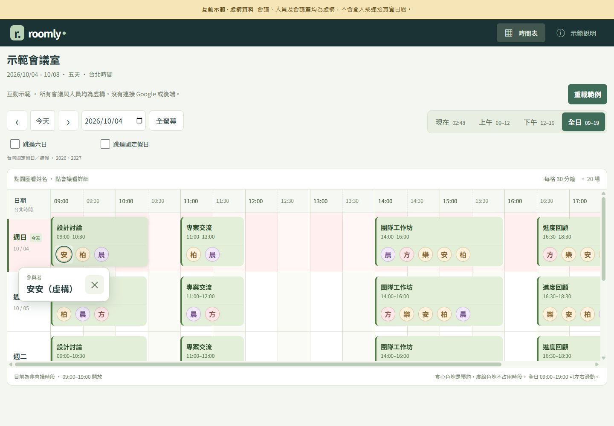
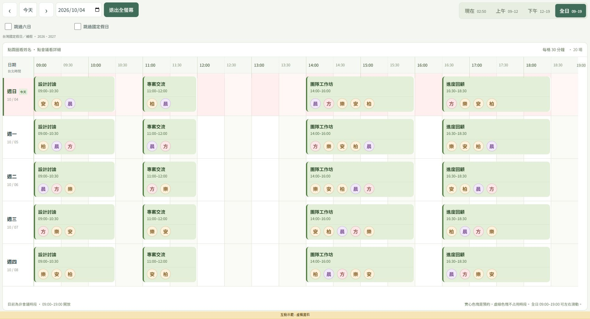
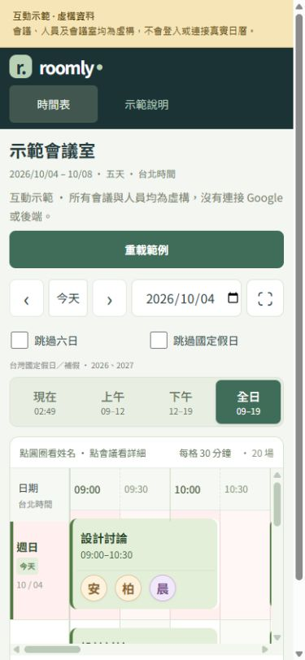

# 操作教學與截圖

Roomly 的實際使用情境是把平板固定在會議室外，以已核准的帳號登入並開啟全螢幕看板，讓大家查看目前及接下來的預約。其他成員可在手機安裝完整版 PWA，用自己的帳號登入，查看同一個會議室的預約與空白時段；預約仍由成員在 Google 日曆建立或修改。

看板依已授權 Google 日曆中符合會議室地點的活動顯示資料，不會感測現場是否有人，也不會記錄實際出席。空白時段只代表目前已授權來源沒有相符預約，不能保證實體會議室無人使用；最新資訊也受授權狀態、網路與同步時間影響。

先開啟 [線上展示](https://terry-eric.github.io/roomly/)，或依 [README](../README.md) 執行 `npm run demo`。以下截圖取自實際展示版，會議、人物和地點全部虛構；日期會依開啟當天產生。

## 1. 查看預約

每一列是一個日期，每一格是三十分鐘。色塊表示預約，圓圈表示受邀者；空白表示範例中沒有預約。時間範圍為台北時間 09:00–19:00。

用日期旁的箭頭或日期欄切換開始日，按「今天」回到當天。可勾選「跳過六日」或「跳過國定假日」；國定假日資料內建 2026、2027 年。按「上午」、「下午」或「全日」切換查看的時段，按「現在」移到目前時段。

## 2. 點人物與會議

直接點預約上的人物圓圈，會出現完整姓名；按小視窗的叉號關閉。點會議色塊可查看時間與受邀者等詳細資料。正式版有 Meet 連結時，詳細資料才提供加入會議入口。

受邀者表示日曆邀請中的人員，不代表已實際出席。展示版不會連到真實會議，也不會預約或修改日曆。

## 3. 全螢幕預覽

按日期旁的「全螢幕」，畫面會集中顯示日期、時段切換與甘特圖。可在甘特圖內左右滑動查看時間、上下滑動查看日期；按「退出全螢幕」回到原畫面。桌面原生全螢幕也可按 `Esc` 離開。

瀏覽器不支援原生全螢幕時，會使用頁面內的滿版預覽；瀏覽器網址列是否隱藏仍由裝置及瀏覽器決定。

## 4. 手機與平板

小螢幕會讓日期、篩選及時段按鈕分行排列。甘特圖保留可點選的寬度，可在表格內橫向滑動。平板橫放可同時查看更多時段。

要用手機看自己電腦的虛構範例，依 README 的區域網路預覽步驟啟動；兩台裝置須在同一網路。正式 PWA 安裝需要部署完整 HTTPS 版本，GitHub Pages 展示版沒有安裝或 Google 登入功能。

## 5. 從範例改成真實使用

「重載範例」只重新產生本機虛構資料，不能同步 Google 日曆。要讀取團隊會議，部署 [Cloudflare Workers + D1 完整版](DEPLOYMENT.md)，由管理員設定地點並核准成員，讓每位成員完成本人日曆授權。來源和同步細節見 [共用日曆說明](SHARED-CALENDAR.md)。

要把這個展示網址分享給別人，請按 [GitHub Pages 發布教學](DEPLOYMENT.md#github-pages發布展示版) 建立自己的網站；不需要為展示版設定任何密鑰。
